# ENEL373 LTspice Setup Guide

This guide was made by Bailey Allen, based on the original guide by Dr. Chris Hann.

- [Windows](#windows)
- [macOS](#macos)
- [Linux](#linux)


## Windows

### Installation

Choose one of the following methods to install LTspice on Windows:

#### Method 1: Download using `winget`

1. Open the start menu and search for 'Terminal'.

2. Within the terminal, run:

    ``` powershell
    winget install AnalogDevices.LTspice
    ```

    <p align="center">
        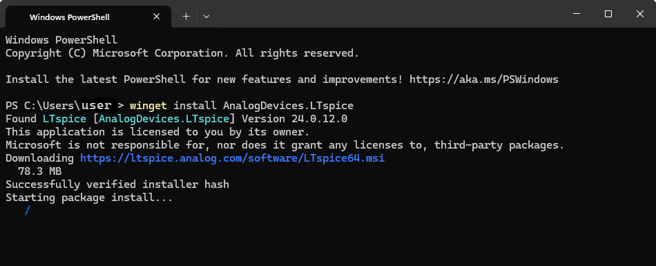
    </p>

3. Accept any licenses and wait for the installation to complete.

#### Method 2: Download from the LTspice website

1. Go to the [LTspice download page](https://www.analog.com/en/design-center/design-tools-and-calculators/ltspice-simulator.html) and download the Windows version (24+).

    <p align="center">
        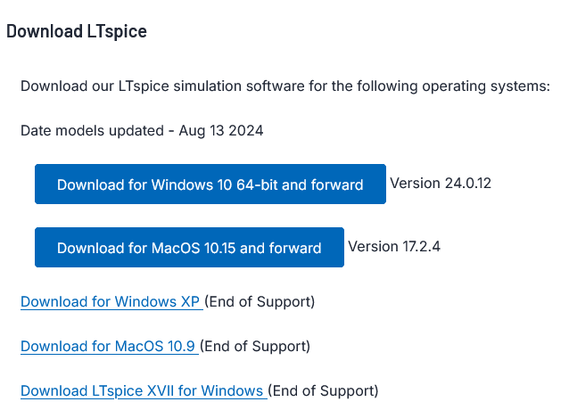
    </p>

2. Launch the LTspice installer, and follow the install instructions.

3. Ensure that you set LTspice to install for *All users*.

    <p align="center">
        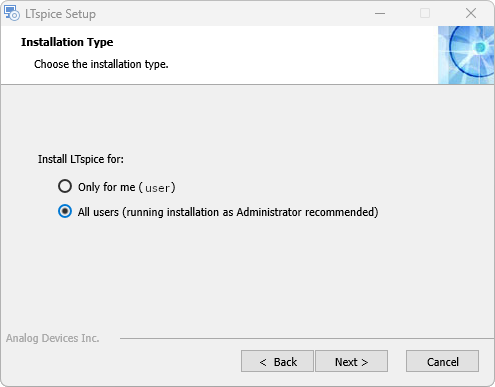
    </p>

### Project Setup

1. There is a bug in the LTspice software which is sometimes present where an `e` may appear in the first line of the `standard.bjt` file. You need to delete this before proceeding.

    - Open File Explorer, and in the path bar, type `%localappdata%` and press enter.

        <p align="center">
        
        </p>

    - Navigate to `LTspice\lib\cmp\` and open the `standard.bjt` file in a text editor.

    - Delete the `e` character from the first line of the file. If there is no `e`, then you can skip this step!

    ``` spice
    ⌄
    e* Copyright � 2000 Linear Technology Corporation.   All rights reserved.
    *
    *
    .model 2N2222 NPN(IS=1E-14 VAF=100
    +   BF=200 IKF=0.3 XTB=1.5 BR=3
    +   CJC=8E-12 CJE=25E-12 TR=100E-9 TF=400E-12
    +   ITF=1 VTF=2 XTF=3 RB=10 RC=.3 RE=.2 Vceo=30 Icrating=800m  mfg=NXP)

    ...
    ```

2. Back to your project directory, open the `run_TL494_test_CEH.asc` file in LTspice. It should show an empty spot for the TL494 to be placed.

    <p align="center">
    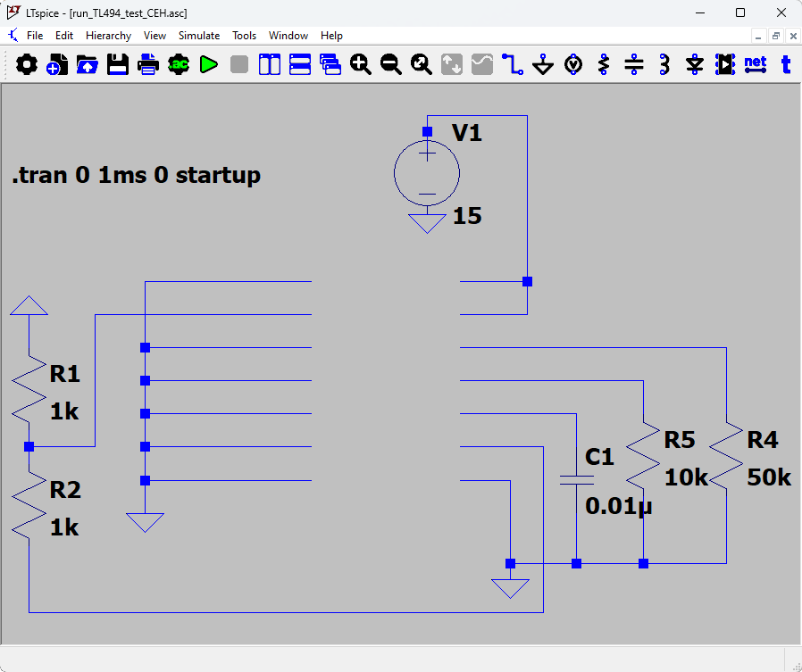
    </p>

3. Drag the `TL494_CEH.sub` file into the LTspice window, which should open a window showing the code for the TL494 chip.

4. Ensure that *both* `.lib` lines between the `***`'s correspond to the pathname for the `standard.dio` and `standard.bjt` files within your LTspice directory.

    The default path should work without alteration, however if LTspice has issues finding the files, you may need to change to the full path of these files, for example:

    ``` spice
    .lib C:\Users\USERNAME\AppData\Local\LTspice\lib\cmp\standard.dio
    ```

5. On the blue `.subckt` line, highlight `TL494_CEH`, right-click, then select *Create Symbol*.

    <p align="center">
    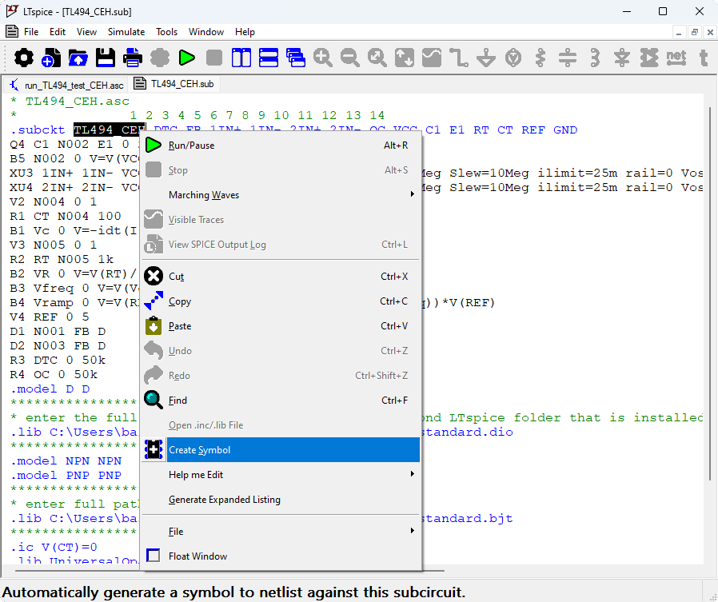
    </p>

6. Save the `TL494_CEH.asy` file to the same directory as your project.

    You can now close the `TL494_CEH.asy` and `TL494_CEH.sub` files by right clicking on their tabs and selecting **× Close**.

    <p align="center">
    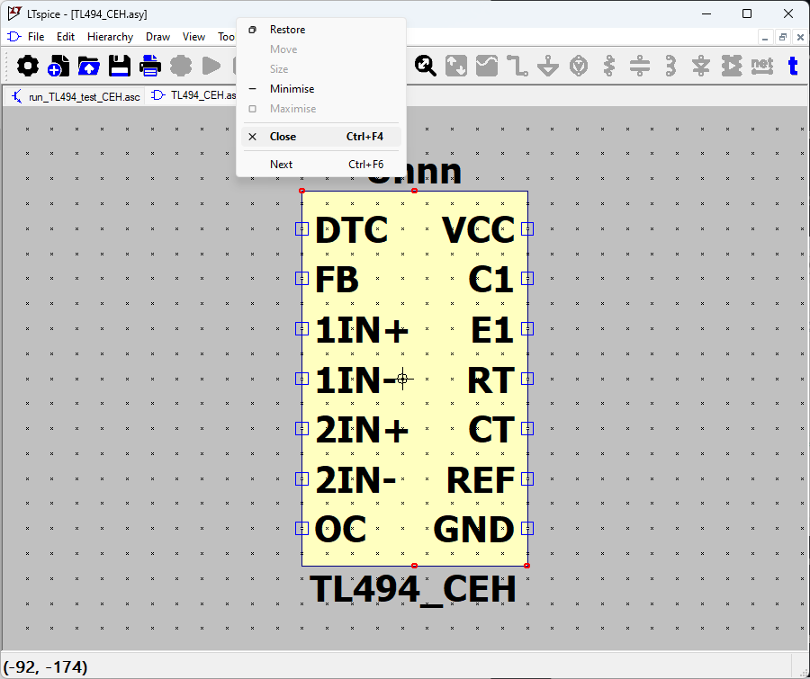
    </p>

7. You should now be back to the `run_TL494_test_CEH.asc` schematic. To insert the TL494, click on *Component* .

8. Change the *Top Directory* to your project directory. Select `TL494_CEH`, and click *Place*.

    <p align="center">
    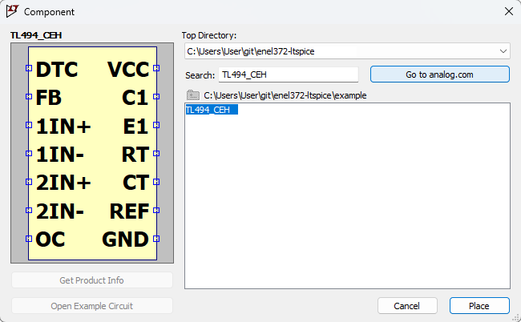
    </p>

9. Drag and drop the TL494 into the empty spot in the schematic. To stop placing components, right-click.

10. To simulate the circuit, we first need to change the simulation settings. Click *Simulate* >  *Settings*.
    
    <p align="center">
    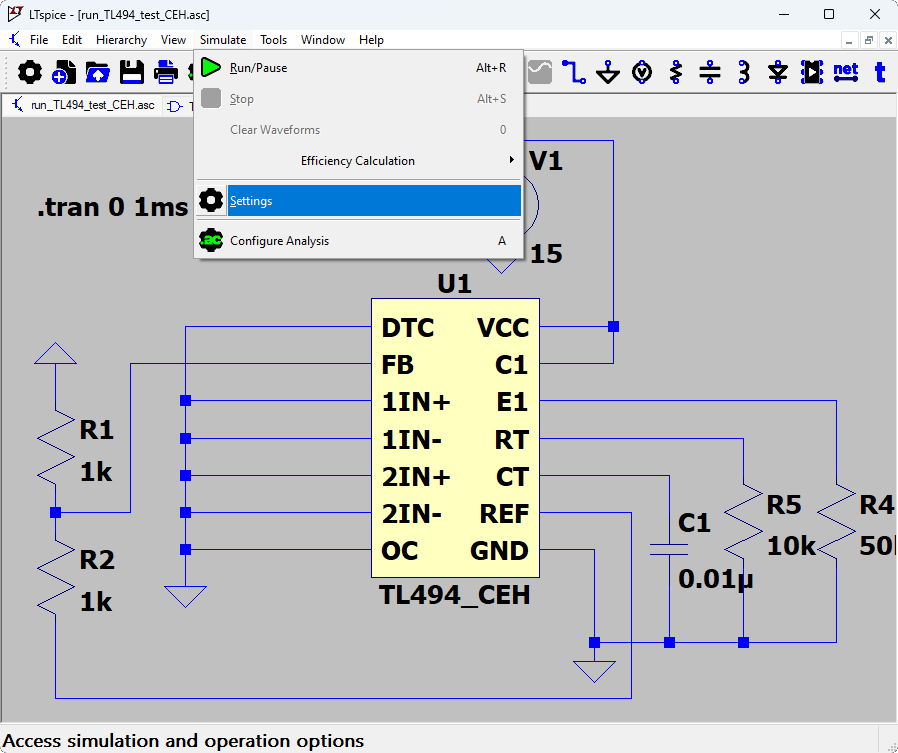
    </p>

11. Within Settings, go to the *SPICE* tab. Change `Gmin`, `Abstol`, `Chgtol`, and `Volttol` to *1e-006*. Change the *Default Integration method* to `Gear`, otherwise there are errors in the ode45 solver and it runs very slowly. Click *OK* to confirm settings.

    <p align="center">
    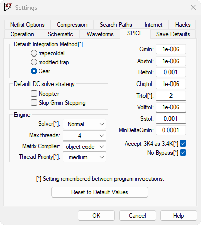
    </p>
    
12. To run the simulation, click *Run*.

13. To check if the simulation ran correctly, select click the `E1` wire . A square wave should show in the waveform viewer.

    <p align="center">
    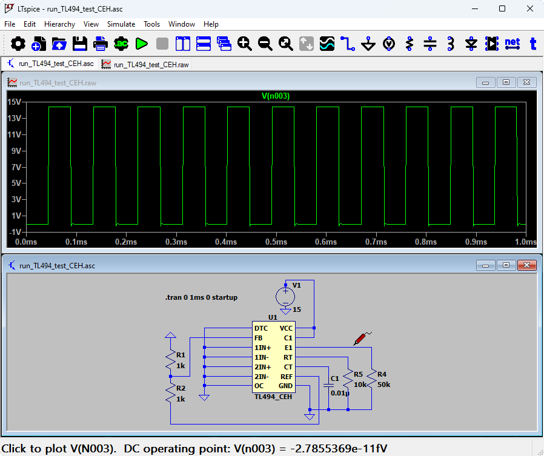
    </p>

## macOS

### Installation

Choose one of the following methods to install LTspice on Windows:

#### Method 1: Download using `homebrew`

Note, this method requires the [Homebrew Package Manager](https://brew.sh/) to be installed.

1. Open a console window.

2. Within the terminal, run:

    ``` bash
    brew install ltspice
    ```

    and enter your user password if prompted.

    <p align="center">
        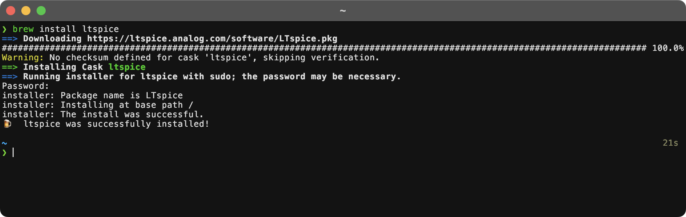
    </p>


#### Method 2: Download from the LTspice website

1. Go to the [LTspice download page](https://www.analog.com/en/design-center/design-tools-and-calculators/ltspice-simulator.html) and download the macOS version (17+).

    <p align="center">
        
    </p>

2. Launch the LTspice.pkg installer, and follow the install instructions.


### Project Setup

1. Back to your project directory, open the `run_TL494_test_CEH.asc` file in LTspice. It should show an empty spot for the TL494 to be placed.
    
    You may need to set LTspice as the default application for `.asc` files. Right-click on the file, select *Get Info*, change the *Open with* option to LTspice, and click *Change All...*.

    <p align="center">
    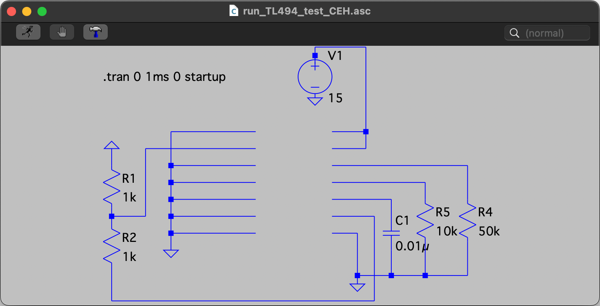
    </p>

3. Right click the `TL494_CEH_macOS.sub` in finder, and select *Get Info* as before. Change the *Open with* option to LTspice.

    If LTspice does not show in the drop-down list, select *Other...*, and search for LTspice.app in your applications folder. If LTspice is greyed out, change the *Enable* dropdown to *All Applications*.

    <p align="center">
    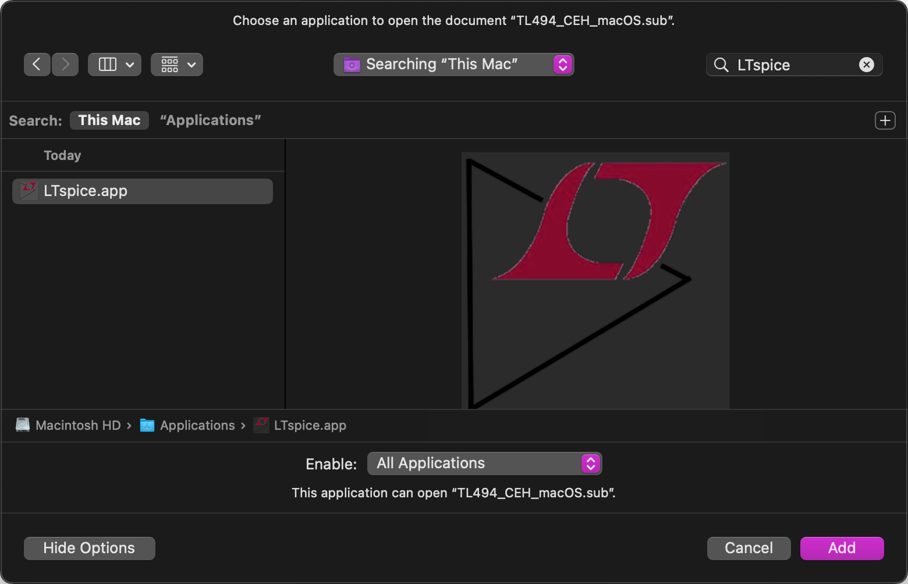
    </p>

    Once LTspice is selected, click *Change All...*, and then you should be able to open the file by clicking on it in finder.

4. Ensure that *both* `.lib` lines between the `***`'s correspond to the pathname for the `standard.dio` and `standard.bjt` files within your LTspice directory.

    The default path should work without alteration, however if LTspice has issues finding the files, you may need to change to the full path of these files, for example:

    ``` spice
    .lib /Users/$USER/Library/Application Support/LTspice/lib/cmp/standard.bjt
    ```

5. On the blue `.subckt` line, highlight `TL494_CEH`, right-click, then select *Create Symbol*.

    <p align="center">
    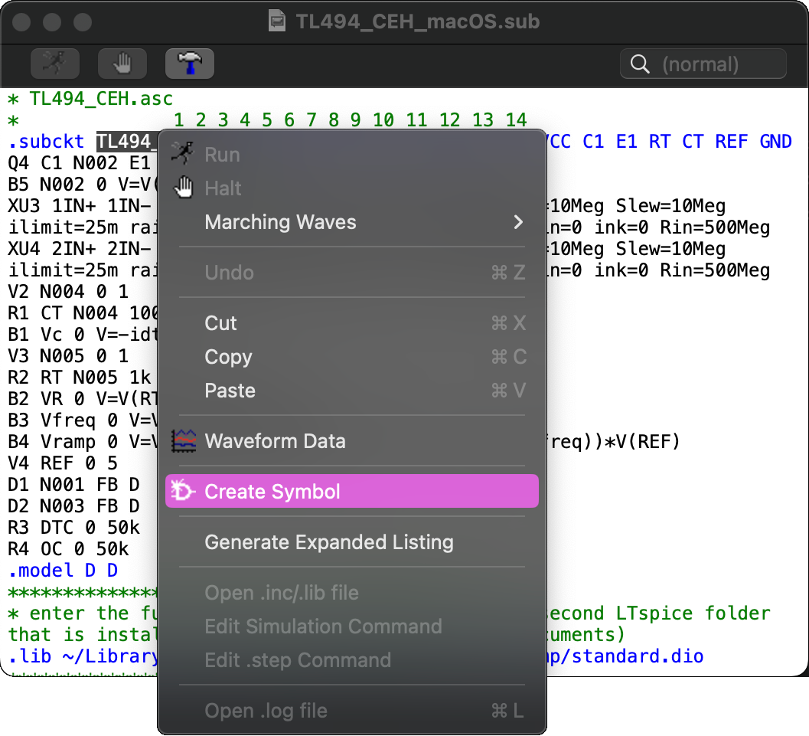
    </p>

6. Save the `TL494_CEH.asy` file to the same directory as your project.

    <p align="center">
    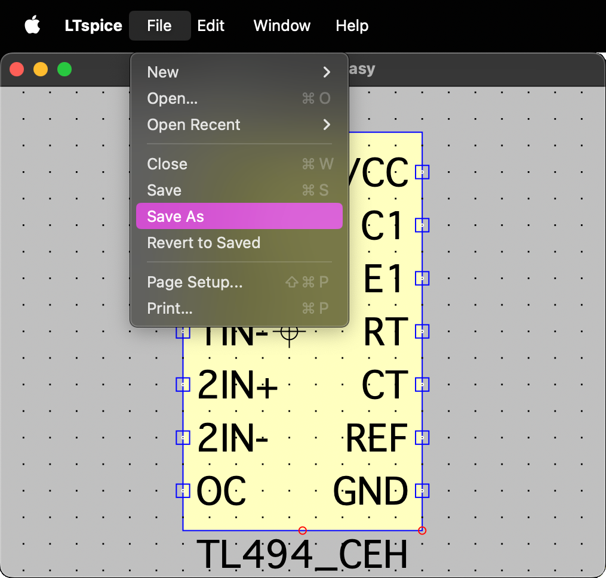
    </p>

    <p align="center">
    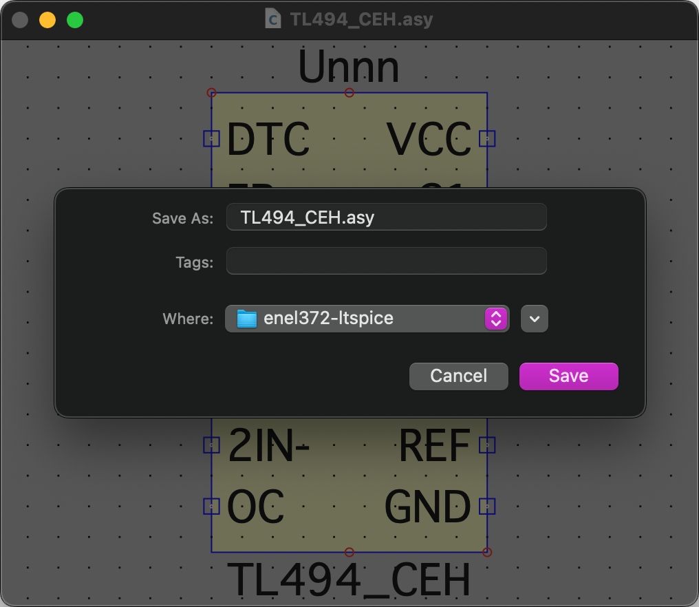
    </p>

    You can now close both the `TL393_CEH_macOS.sub` and `TL494_CEH.asy` files.

7. You should now be back to the `run_TL494_test_CEH.asc` schematic. To insert the TL494, Secondary click anywhere on the schematic, and select*Draft* > *Component*, or simply press the `F2` key.

8. Change the *Top Directory* to your project directory. Select `TL494_CEH`, and click *Ok*.

    <p align="center">
    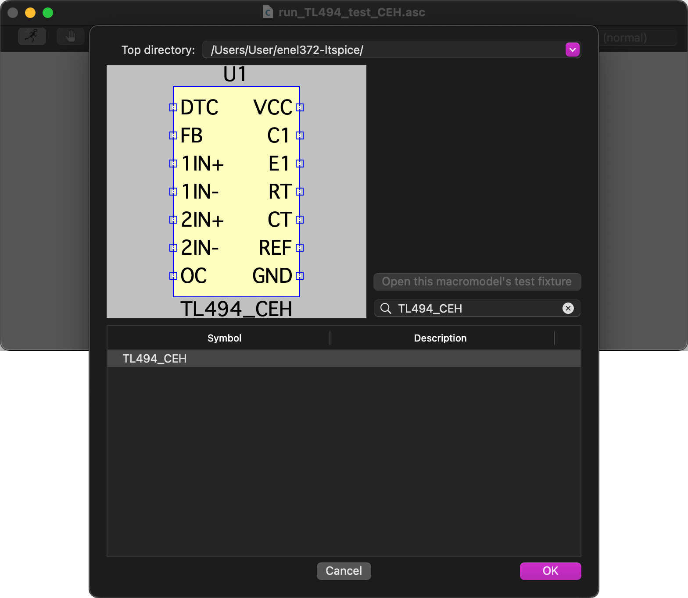
    </p>

9. Drag and drop the TL494 into the empty spot in the schematic. To stop placing components, secondary-click.

10. To simulate the circuit, we first need to change the simulation settings. Click  *Tools*.

11. Within Settings, go to the *SPICE* tab. Change `gmin`, `abstol`, `chgtol`, and `volttol` to *1E-006*. Change the *Default Integration method* to `Gear`, otherwise there are errors in the ode45 solver and it runs very slowly. Click *OK* to confirm settings.

    <p align="center">
    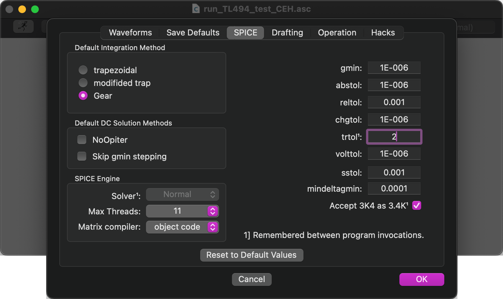
    </p>
    
12. To run the simulation, click *Run*.

13. To check if the simulation ran correctly, select click the `E1` wire . A square wave should show in the waveform viewer.

    <p align="center">
    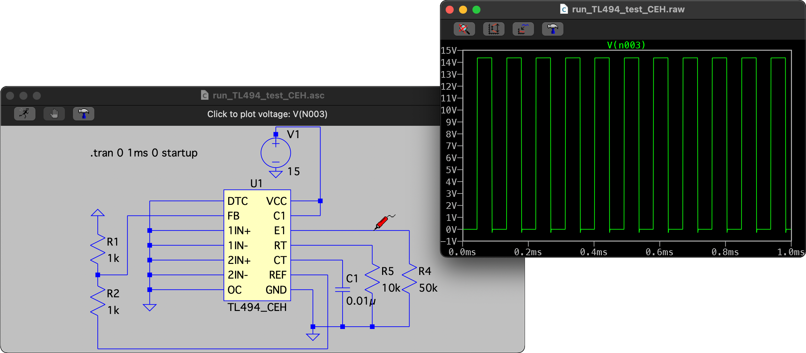
    </p>


## Linux

🚧 Under Construction 🚧
